# Waste Classification

## Description
The project consists in a full pipeline, from data collection to deployement, with output a deep learning model capable of classifying waste in one of six categories:
- plastic
- glass
- metal
- paper
- cardboard
- trash

Waste classification could be performed by low-powered devices: consider, for example, a smart trash bin that scans waste and sorts it into the correct containers based on its classification. Such a system could be equipped with an embedded device with low computing power. Considering similiar cases, the MobileNet architecture was chosen, as it is small and properly designed to run on mobile and embedded systems, making it a right choice. MobileNetV3 was fine-tuned on a waste dataset with good result.

## Tech stack

**Data collection:**
- Kaggle API
- Pandas

**Training**:
- Pytorch Lightning

**Logging**:
- Tensorboard

**Inference**
- ONNX
- FastAPI

## Project Structure
```
Waste Classification
 ┣ 📂models
 ┃ ┣ 📜model_large.onnx
 ┃ ┗ 📜model_small.onnx
 ┣ 📂notebooks
 ┃ ┣ 📜dataset_details.ipynb
 ┃ ┣ 📜export_model.ipynb
 ┃ ┣ 📜inference_onnx.ipynb
 ┃ ┣ 📜mean_std.ipynb
 ┃ ┣ 📜prepare_dataset.ipynb
 ┃ ┗ 📜train_models.ipynb
 ┣ 📂training
 ┃ ┣ 📂checkpoints
 ┃ ┣ 📂config
 ┃ ┃ ┣ 📜config_large_v1.yaml
 ┃ ┃ ┣ 📜config_small_v1.yaml
 ┃ ┃ ┣ 📜config_small_v2.yaml
 ┃ ┃ ┣ 📜config_small_v3.yaml
 ┃ ┃ ┗ 📜config_tests.yaml
 ┃ ┗ 📂metrics
 ┣ 📂wastenet
 ┃ ┣ 📜dataset.py
 ┃ ┣ 📜inference.py
 ┃ ┣ 📜model.py
 ┃ ┣ 📜tests.ipynb
 ┃ ┣ 📜test_metrics.ipynb
 ┃ ┣ 📜train.py
 ┃ ┗ 📜__init__.py
 ┣ 📜.gitignore
 ┣ 📜README.md
 ┣ 📜requirements.txt
```

```checkpoints/``` directory contains checkpoints for the best trained models, while ```metrics/``` contains metrics for each experiments.
## Project Requirements
To replicate the entire pipeline, from data collection to export, install the required packages with:
```bash
pip install -r training_requirements.txt
```
otherwise, if you only want to use the models for inference, run:
```bash
pip install -r inference_requirements.txt
```

## Workflow
The flowchart below illustrates the pipeline.

```mermaid 
flowchart LR
    Data_Collection["📂 Data Collection"] --> train_models

    subgraph Experiment["🔁 Experiment Loop"]
        Config_File["📝 Config File"] --> train_models["⚙️ Training"]
        train_models --> Evaluation["📊 Evaluation"]
        Evaluation -.->|change settings| Config_File
    end

    Evaluation --> export_onnx["📦 Export to ONNX"]
    export_onnx --> API["🌐 Inference API"]

``` 

## Data Collection
Data collection consists in downloading two datasets from Kaggle, performing class selection and merging. For each class, at least 800 examples were collecting. The datasets used are the following:
- [TrashNet dataset with annotations](https://www.kaggle.com/datasets/asdasdasasdas/garbage-classification?select=Garbage+classification)
- [Garbage Classification](www.kaggle.com/datasets/mostafaabla/garbage-classification)
To download and prepare data, the notebook ```prepare_dataset.ipynb``` is used. Using Kaggle API, Pandas and other system libraries, the two dataset are downloaded, classes of interest from the second dataset are selected, the two datasets are merged and annotations for train, validation e testing set are produced. The dataset is then saved in folder data/.
## Experiments
Experiments are described in detail in ```docs/report.pdf```. For each experiment, logging is performed via **Tensorboard**. Each experiments consinsts in a different configuration of hyperparameters and data augmentation . Losses, Accuracy, Precision, Recall, $F_1$ score and Precision-Recall curves are logged for each experiment.  Among the conducted experiments,  Metrics, checkpoints and configuration files conducted experiments are available in ```training/``` folder. **Tensorboard** was used for logging 

## Training
Pytorch Lightning was used for training the network. The directory ```wastenet/``` and its files are related to training as described above:

- ```dataset.py```: contains implementation of a DataLoader and a DataModule for loading the dataset;

- ```model.py```: contains implementation of a LightningModule, which contains all methods about training, testing and logging.

- ```train.py```: contains the WasteClassifierTrainer class, which is a wrapper for a Pytorch Lightning Trainer object . This class provides an interface for repating the training process, using different configurations of hyperparameters and data augmentation read from a YAML file.
- ```inference.py```: contains the InferenceSession class, which is a wrapper for a ONNX inference session. This class makes the trained model ready to use, as it also handles required pre-processing of images before classification.


## Inference API

### Model export
Starting from a checkpoint, the model can be exported to [ONNX](https://onnx.ai/) format. This makes the model capable of running outside the training environment, using the ONNX runtime. Furthermore, using ONNX the model can be optimized to run even faster on embedded and mobile devices. Using this format, inference is very fast using a **Raspberry Pi 4** (4 GB). 

### Inference Session
Inference is served by the InferenceSession class, that loads a MobileNet exported in ONNX to run inference on Images. This class can be used directly with the notebook inference_onnx.ipynb or with the FastAPI server The API was tested on a **Raspberry Pi 4** (4 GB), which is capable of running the "large" version of the trained model.
### FastAPI
A FastAPI server for inference was made with endopoint ```/predict```. To run the API run the following command in the project directory:

```bash
fastapi run app/app.py
```
You can then POST images for inference.
### Notebook
An example of inference without using FastAPI is the notebook ```inference_example.ipynb```

## Cross-platform app
Part of the project is the [WasteScanner]() app, a front-end for the API. It consists in a simple cross platform that lets users pick an image for prediction. The app was built with React-Native and thus can ran in Web, Android and iOS.
