# Waste Classification

## Description
This project implements a full pipeline - from data collection to deployment -resulting in a  deep learning model capable of classifying waste in one of six categories:
- plastic
- glass
- metal
- paper
- cardboard
- trash

Waste classification could be performed by low-powered devices, such as a smart trash bin that scans waste and sorts it into the correct containers based on its classification. Considering similar cases, the MobileNetV3 architecture was chosen, as it is small and properly designed to run on mobile and embedded systems, making it a suitable choice for embedded applications. MobileNetV3 was fine-tuned on a dataset of waste images with good results in both the "small" and "large" versions.

# Tech Stack

### 📊 Data Collection
- [Kaggle API](https://www.kaggle.com/docs/api)  
- [Pandas](https://pandas.pydata.org/)

### 🧠 Training
- [PyTorch Lightning](https://www.pytorchlightning.ai/)

### 📈 Logging & Monitoring
- [TensorBoard](https://www.tensorflow.org/tensorboard)

### ⚡ Inference & Deployment
- [ONNX](https://onnx.ai/)  
- [FastAPI](https://fastapi.tiangolo.com/)


## Project Structure
```
Waste Classification
 ┣ 📂app
 ┃ ┣ 📜app.py
 ┣ 📂docs
 ┃ ┣ 📜experiments.md
 ┃ ┣ 📜screen_app.jpg
 ┣ 📂models
 ┃ ┣ 📜model_large.onnx
 ┃ ┗ 📜model_small.onnx
 ┣ 📂notebooks
 ┃ ┣ 📜dataset_details.ipynb
 ┃ ┣ 📜export_model.ipynb
 ┃ ┣ 📜inference_onnx.ipynb
 ┃ ┣ 📜mean_std.ipynb
 ┃ ┣ 📜prepare_dataset.ipynb
 ┃ ┗ 📜train_models.ipynb
 ┣ 📂training
 ┃ ┣ 📂checkpoints
 ┃ ┣ 📂config
 ┃ ┃ ┣ 📜config_large_v1.yaml
 ┃ ┃ ┣ 📜config_small_v1.yaml
 ┃ ┃ ┣ 📜config_small_v2.yaml
 ┃ ┃ ┣ 📜config_small_v3.yaml
 ┃ ┃ ┗ 📜config_tests.yaml
 ┃ ┗ 📂metrics
 ┣ 📂wastenet
 ┃ ┣ 📜dataset.py
 ┃ ┣ 📜inference.py
 ┃ ┣ 📜model.py
 ┃ ┣ 📜train.py
 ┃ ┗ 📜__init__.py
 ┣ 📜.gitignore
 ┣ 📜README.md
 ┣ 📜pipeline_requirements.txt
 ┣ 📜inference_requirements.txt
```

```checkpoints/``` directory contains checkpoints for the best trained models, while ```metrics/``` contains metrics for each experiments.
## Project Requirements
To replicate the entire pipeline, from data collection to export, install the required packages with:
```bash
pip install -r pipeline_requirements.txt
```
otherwise, if you only want to use the models for inference, run:
```bash
pip install -r inference_requirements.txt
```
## Quickstart
To run inference you can:
- use notebook ```inference_onnx.ipynb``` specifying image path;
- start the API:

    ```bash
    fastapi run app/app.py
    ```
    and then POST images to endpoint ```/predict``` using the app [Waste Scanner]() or tools like curl.

## Workflow
The flowchart below illustrates the pipeline.

```mermaid 
flowchart LR
    Data_Collection["📂 Data Collection"] --> train_models

    subgraph Experiment["🔁 Experiment Loop"]
        Config_File["📝 Config File"] --> train_models["⚙️ Training"]
        train_models --> Evaluation["📊 Evaluation"]
        Evaluation -.->|change settings| Config_File
    end

    Evaluation --> export_onnx["📦 Export to ONNX"]
    export_onnx --> API["🌐 Inference API"]

``` 

Details of each step are provided below.

## Data Collection
Data collection involves downloading two datasets from Kaggle, performing class selection and merging. Each class includes at least 830 examples. The datasets used are the following:
- [TrashNet dataset with annotations](https://www.kaggle.com/datasets/asdasdasasdas/garbage-classification?select=Garbage+classification)
- [Garbage Classification](www.kaggle.com/datasets/mostafaabla/garbage-classification)

To download and prepare data, notebook ```data_collection.ipynb``` is used. Using Kaggle API, Pandas and other system libraries, the two dataset are downloaded, classes of interest from the second dataset are selected, the two datasets are merged and annotations for training, validation and testing sets are produced. The dataset is then saved in folder ```data/```. Annotations are in CSV format with columns "filename" and "class". Classes are indexed from 0 to 5. After data collection, means and standard deviations per channel are computed as described in notebook ```mean_std.ipynb```. Details about classed distribution can be found in notebook ```dataset_details.ipynb```

## Training
Pytorch Lightning was used for training the network. The directory ```wastenet/``` contains the following files related to training:

- ```dataset.py```: implements a DataLoader and a DataModule for loading the dataset;

- ```model.py```: implements a LightningModule defining training, testing, and logging routines.

- ```train.py```: contains the WasteClassifierTrainer class, which wraps a PyTorch Lightning Trainer to streamline repeated experiments with different configurations.

## Experiments
Each experiment consists in training the network with a different configuration of hyperparameters and data augmentation.  Each configuration corresponds to a YAML file, located in ```training/config/``` Losses, Accuracy, Precision, Recall, $F_1$ score and Precision-Recall curves are logged using **Tensorboard**. Among the conducted experiments, metrics, checkpoints and configuration files for conducted experiments are available in ```training/``` folder. 
The output of the experiment loop is one model for the "small" architecture and one for the "large". Additional experiments can be conducted by adding new YAML configurations.
The table below contains metrics computed on the test sets for the best models. 

<p align = "center">

| Metric | MobileNetV3 Small | MobileNetV3 Large |
|:---|:---:|:---:|
| Accuracy | 0.9434 | 0.9582 |
| $F_1$ score | 0.9481 | 0.9579 |
| Precision | 0.9483 | 0.9581 |
| Recall | 0.9482 | 0.9580 |

</p>

More details about experiments can be found in ```docs/experiments.md```

## Inference API

### Model export
Starting from a checkpoint, the model can be exported to [ONNX](https://onnx.ai/) format. This makes the model capable of running outside the training environment, using the ONNX runtime. Furthermore, using ONNX the model can be optimized to run even faster on embedded and mobile devices. Using this format, inference is fast using a **Raspberry Pi 4** (4 GB),  which is capable of running the "large" version of the model. The export script can be found in ```export_model.ipynb```

### Inference Session
Inference is served by the InferenceSession class, that loads a MobileNet exported in ONNX to run inference on Images, also handling required pre-processing. The class is implemented in  ```wastenet/inference.py```.
### FastAPI
A FastAPI server for inference was made with endpoint ```/predict```. primary device for testing the API was a **Raspberry PI 4**. To start the API refer to [Quickstart](#quickstart)
## Waste Scanner
Part of the project is the [WasteScanner]() app, a front-end for the API. It is a cross platform that allows users to upload an image for prediction. The app was built with React-Native and thus can run in Web, Android and iOS.

<p align="center">
  
  
</p>

