# Experiments for the Waste Classification project

## Experimental setup
To train the models, my local machine consisting in an Intel Core i7-10700 and 32GB of DDR4 RAM was used. Thus the training was conducted on CPU. A total of 4 experiments were made, of which 3 are for the "small" version of the MobileNetV3 architecture and one for the "large". Each experiment corresponds to a different training cofiguration, defined via a YAML file which the WasteClassifierTrainer class uses when the costructor is called. Thi class makes the entire experiment loop replicable, providing an interface that also facilitates new experiments.

## Metrics
The following metrics are computed on all sets:
- Accuracy
- Precision
- Recall
- $F_1$ score

Moreover, Precision-Recall curves, both ones with micro-average and ones for each class, and confusion matrices are saved on the testing set. Since the dataset presents class inbalance, accuracy is not a reliable metric. Each class is equally important and mistaking one class for another may not lead to serious consequences. Thus, $F_1$ score is the ideal metric for the chosen problem. All metrics are computed using the "weighted" average.

## Transforms on sets
The transforms defined on the training set are the following:
- RandomResizedCrop DESCRIVERE
- RandomHorizontalFlip
- RandomVerticalFlip
- RandomRotation
- ColorJitter

The values for RandomResizedCrop are fixated to:
- scale: (0.5, 1.0)
- ratio: (0.75, 1.33)

The other transformations are read from the configuration file.

For validation and testing, the following deterministic transformations are defined:
- Resize(256)
- CenterCrop(224)

Defined transforms are coherent on those tipically defined when training a CNN on ImageNet, which is the case for MobileNet.
For all sets, images are normalized with mean and standard deviation pre-computed on the training set.

## Checkpointing
Early stopping is used, monitoring validation_loss and with patience setted in the configuration file. During training, the model with the best $F_1$ score on validation set is saved. Thus there are two checkpoints for each experiment: the "best" checkpoint and the "last" checkpoint, which corresponds to the last epoch. Performance of "best" and "last" checkpoints are compared in each experiment.

## Fixed Parameters
The chosen optimizer. The following parameters, related to optimization and checkpointing, are the same for all experiments, butcan be tuned in configuration files. The chosen optimizer is Adam with Cross Entropy loss.

## Experiment 1

### Description
Among the chosen augmentation transforms, the most sensible ones are  and color jittering and vertical flipping. Color jittering changes the image brightness, saturation, contrast and hue. Among these, hue is the most sensible parameter. Common cardboard waste is tipically light-brown, thus changing the tonality aggressively may lead to a complete change of color. The same applies for metal, which is tipically silvery-gray. Vertical flipping also needs attention, as it may produce unrealistic poses and shadows. A plastic bottle, for gravity laws, will not stand upside-down. The same applies for glass bottles. Thus, the first experiment consists in setting all parameters except hue and vertical flip. In this experiment, the "small" version of the architecture is used.

### Configuration
The table below shows setted parameters for this experiment.
| Parameter | Value|
| ----------| -----|
|horizontal_flip| 0.5
|vertical_flip| 0
|rotation| 20
|brightness| 0.2
|contrast| 0.2
|saturation| 0.1
|hue| 0
### Results
The training took 57 to 59 seconds for each epoch, with early stopping reached at epoch 19. The "best" checkpoint was saved in epoch 17. The table below contains metrics rounded to the fourth digit.

| Metric | "Last" checkpoint | "Best" checkpoint |
|:---|:---:|:---:|
| Accuracy | 0.9358 | 0.9333 |
| $F_1$ score | 0.9404 | 0.9404 |
| Precision | 0.9408 | 0.9408 |
| Recall | 0.94052 | 0.94052 |

The two checkpoints are almost similar, with the "last" having a slightly better accuracy.
Losses, Confusion Matrix and Precision-Recall Curves for this model are shown below.

| 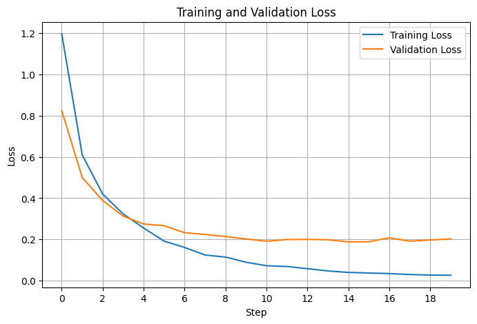 | 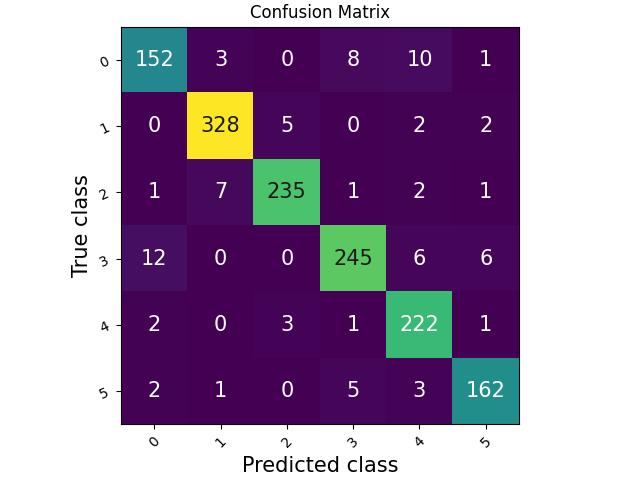 |  
|---------------------------|---------------------------|
| 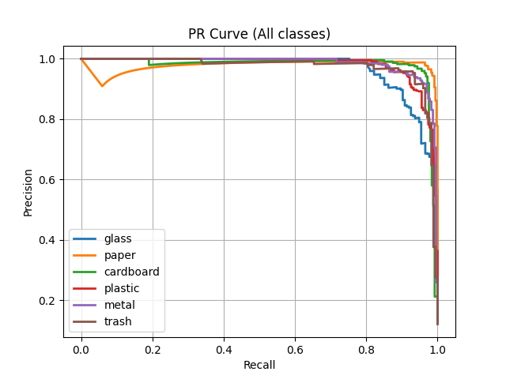 | 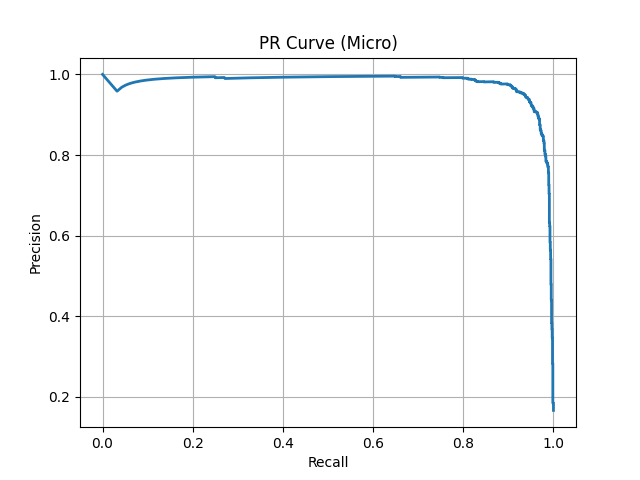

## Experiment 2
### Description 
Let's answer the question: does vertical flipping really deteriorate performance?

### Configuration
Vertical flipping probability is set to 0.5. The other parameters remains unchanged.
### Results
Early stopping happened at epoch 20 and checkpointing at epoch 16. 
| Metric | "Last" checkpoint | "Best" checkpoint |
|:---|:---:|:---:|
| Accuracy | 0.932 | 0.9298 |
| $F_1$ score | 0.9363 | 0.9375 |
| Precision | 0.9381 | 0.9384 |
| Recall | 0.9363 | 0.9377 |

| 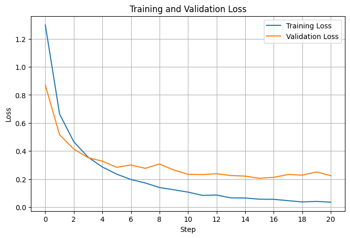 | 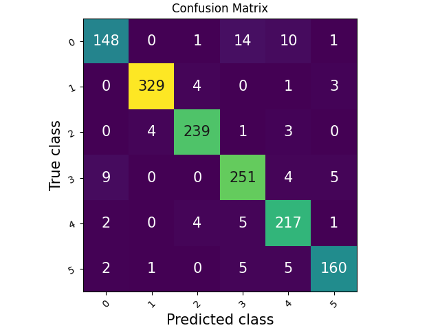 |  
|---------------------------|---------------------------|
| 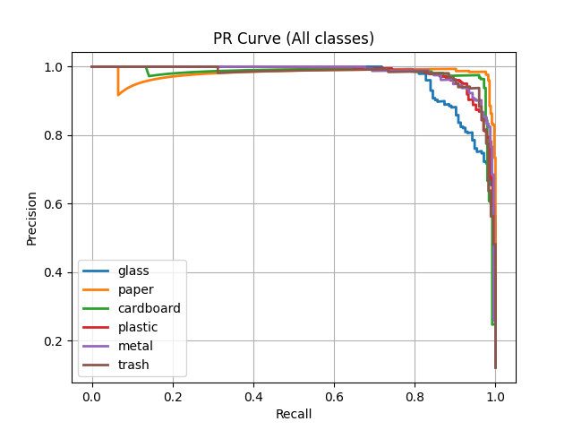 | 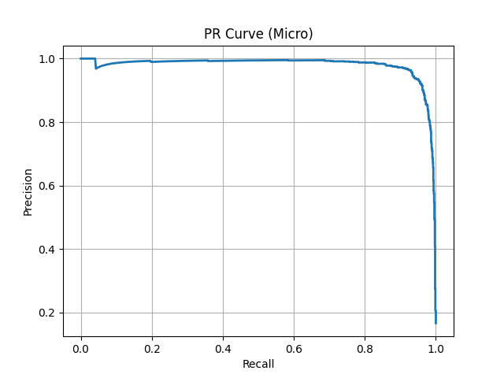

## Experiment 3

### Configuration
Hue is set to 0.1. The other parameters are the same from Experiment 1.
### Results
Early stopping and checkpointing happened at the same epoch, which is the 18. Thus the "last" and "best" checkpoints are the same one.

| Metric | Value |
|:---|:---:|
| Accuracy | 0.9277 | 
| $F_1$ score | 0.9333 | 
| Precision | 0.9340 | 
| Recall | 0.9335 | 

| 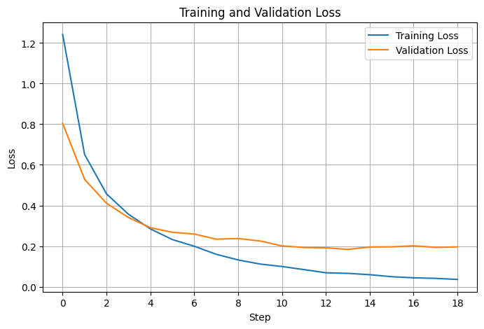 | 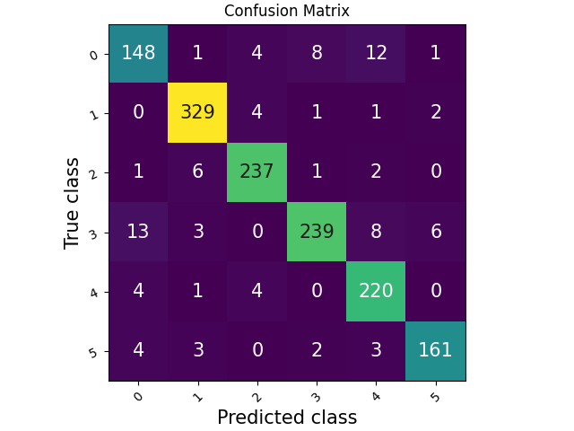 |  
|---------------------------|---------------------------|
| 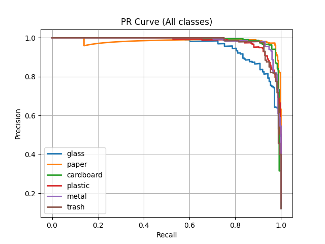 | 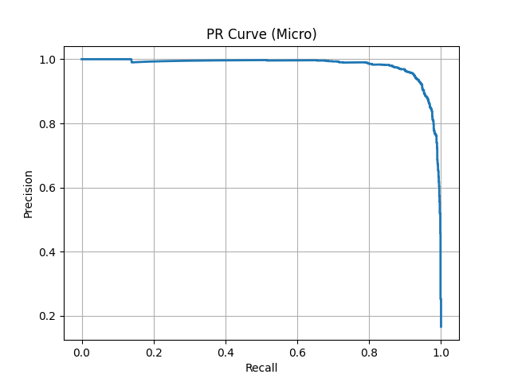

## Experiment 4

### Description
Given that without vertical flipping and hue the "small" version reaches a $F_1$ score of ..., what can the "large" architecture do with the same settings? 

### Configuration
The configuration is the same as Experiment 1, with the only change in the model size which is "large" this time.

### Results
Early stopped happened at epoch 11 and checkpointing at epoch 10.

| Metric | "Last" checkpoint | "Best" checkpoint |
|:---|:---:|:---:|
| Accuracy | 0.9512 | 0.9548 |
| $F_1$ score | 0.9529 | 0.9559 |
| Precision | 0.9536 | 0.9561 |
| Recall | 0.9531 | 0.9559 |

| 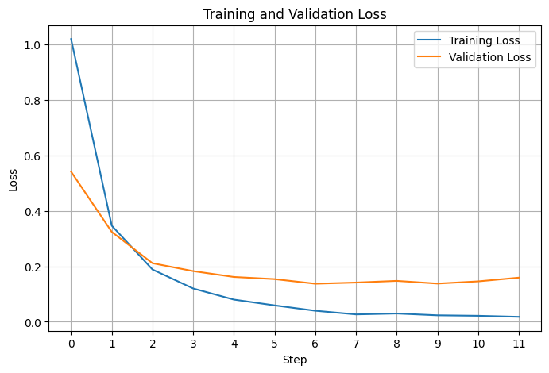 | 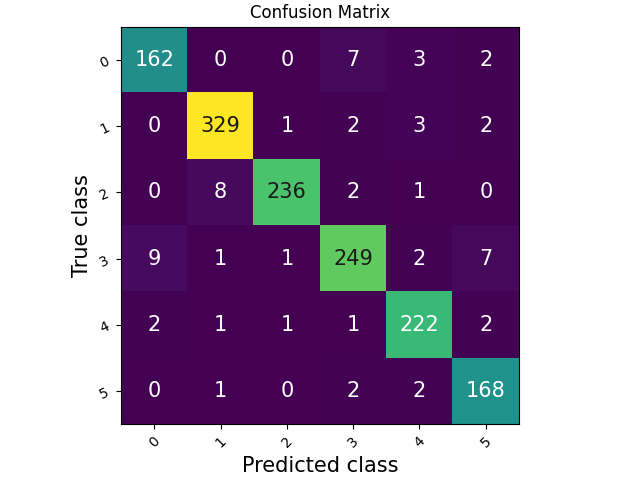 |  
|---------------------------|---------------------------|
| 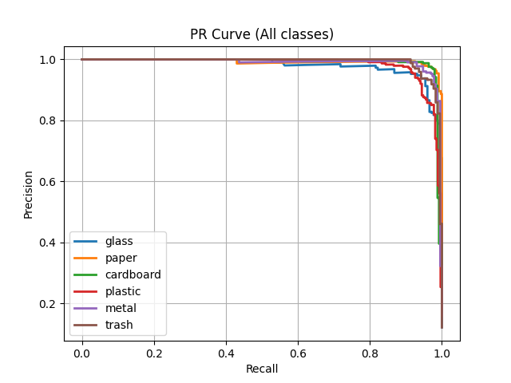 | 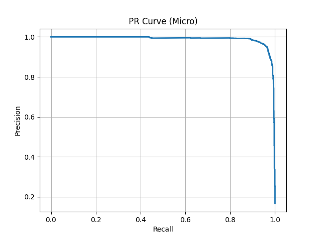

## Conclusions
