# Experiments for the Waste Classification project

## Experimental setup
To train the models, my local machine consisting in an Intel Core i7-10700 and 32GB of DDR4 RAM was used. Training was conducted entirely on CPU, no GPU was used. A total of 4 experiments were made, of which 3 are for the "small" version of the MobileNetV3 architecture and one for the "large". Each experiment corresponds to a different training cofiguration, defined via a YAML file which the WasteClassifierTrainer class uses when the constructor is called. This class makes the entire experiment loop replicable, providing an interface that also facilitates new experiments.

## Metrics
The following metrics are computed on all sets:
- Accuracy
- Precision
- Recall
- $F_1$ score

Moreover, Precision-Recall curves, both ones with micro-average and ones for each class, and confusion matrices are saved on the testing set. Since the dataset presents class imbalance, accuracy is not a reliable metric. Each class is equally important, thus accuracy is not reliable, making $F_1$ score the most representative metric. All metrics are computed using the "weighted" average, which helps in the case of class imbalance.

## Transforms on sets
The transforms defined on the training set are the following:

- RandomResizedCrop
- RandomHorizontalFlip
- RandomVerticalFlip
- RandomRotation
- ColorJitter

The values for RandomResizedCrop are set to:
- scale: (0.5, 1.0)
- ratio: (0.75, 1.33)

The other parameters are read from the configuration file using the following conventions:

| Parameter | Value Type|
| ----------| -----|
|horizontal_flip| Probability
|vertical_flip| Probability
|rotation| Range
|brightness| Range
|contrast| Range
|saturation| Range
|hue| Range

"Range" means a singular value: for example, a random roation with range 90 degrees consists in performing a rotation with an angle chosen randomly in [-90, 90].

For validation and testing, the following deterministic transformations are defined:
- Resize(256)
- CenterCrop(224)

“Transforms are consistent with common practices for ImageNet pretraining, which is the case for MobileNet.

Lastly, for all sets, **images are normalized with means and standard deviations pre-computed on the training set.**
The following table shows the computed means and standard deviations:

 |Channel| Mean | Std | 
 |---| ---| ---|
 |R| 0.6841 | 0.1806|
 |G| 0.6589 | 0.1768 |
 |B| 0.6239 | 0.1862 |

More details about how the transforms work can be found in the official [Pytorch Documentation](https://docs.pytorch.org/vision/main/transforms.html).

## Checkpointing
Early stopping is used, monitoring validation_loss and with patience set in the configuration file. During training, the model with the best $F_1$ score on validation set is saved. Thus there are two checkpoints for each experiment: the "best" checkpoint and the "last" checkpoint, which corresponds to the last epoch. Performance of "best" and "last" checkpoints are compared in each experiment.

## Fixed Parameters
**All experiments use Adam optimizer with Cross-Entropy loss.**. The following parameters, related to optimization and checkpointing, are the same for all experiments, but can be tuned in configuration files.
| Parameter | Value |
| --------- | ----- |
num_workers | 15
lr | 0.0001
epochs | 50
batch_size | 64
patience | 5

## Experiment 1

### Description
Among the chosen augmentation transforms, the most sensible ones are color jittering and vertical flipping. Color jittering changes the image brightness, saturation, contrast and hue. Among these, hue is the most sensible parameter. Common cardboard waste is tipically light-brown, thus changing the tonality aggressively may lead to a complete change of color. The same applies for metal, which is tipically silvery-gray. Vertical flipping also needs attention, as it may produce unrealistic poses and shadows. A plastic bottle, for gravity laws, will not stand upside-down. The same applies for glass bottles. Thus, the first experiment consists in setting all parameters except hue and vertical flip. In this experiment, the "small" version of the architecture is used.

### Configuration
The table below shows setted parameters for this experiment.
| Parameter | Value|
| ----------| -----|
|horizontal_flip| 0.5
|vertical_flip| 0
|rotation| 20
|brightness| 0.2
|contrast| 0.2
|saturation| 0.1
|hue| 0

### Results
The training took 57 to 59 seconds for each epoch, with early stopping reached at epoch 19. The "best" checkpoint.,  was saved in epoch 17. The table below contains metrics rounded to the fourth digit.

| Metric | "Last" checkpoint | "Best" checkpoint |
|:---|:---:|:---:|
| Accuracy | 0.9358 | 0.9333 |
| $F_1$ score | 0.9404 | 0.9404 |
| Precision | 0.9408 | 0.9408 |
| Recall | 0.9405 | 0.9405 |

The two checkpoints are almost similar, with the "last" having a slightly better accuracy.
Losses, Confusion Matrix and Precision-Recall Curves for this model are shown below.

|  | 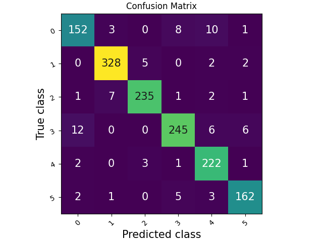 |  
|---------------------------|---------------------------|
| 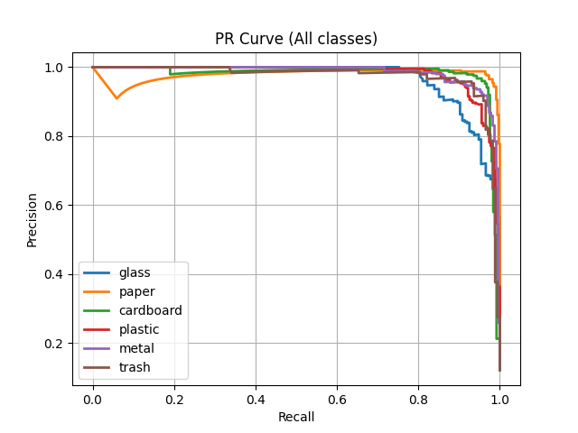 | 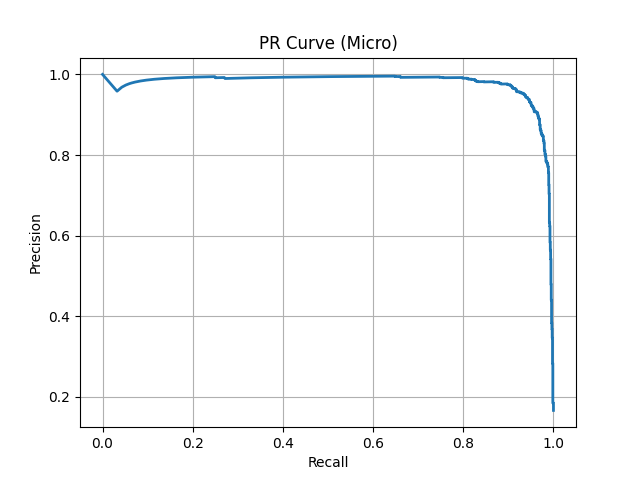

Looking at precision-recall curves, the overall performance is good. However, there are issues with class **paper**. The confusion matrix tells that the primary source of confusion for this class are **cardboard** images, which is clear considering the domain of the problem. **The model struggles to mantain a high precision for class "paper"**. This is reflected in the micro-averaged PR curve. The problem may also be related to heterogeneity of the class. Class "**cardboard**" also has a similar issue, but much lesser problematic.
## Experiment 2
### Description 
Let's answer the question: does vertical flipping deteriorates performance? 

### Configuration
Vertical flipping probability is set to 0.5. The other parameters remains unchanged.

### Results
Early stopping happened at epoch 20 and checkpointing at epoch 16. The following table shows metrics for both checkpoints.
| Metric | "Last" checkpoint | "Best" checkpoint |
|:---|:---:|:---:|
| Accuracy | 0.932 | 0.9298 |
| $F_1$ score | 0.9363 | 0.9375 |
| Precision | 0.9381 | 0.9384 |
| Recall | 0.9363 | 0.9377 |

The "best" checkpoint has better metrics than the "last", apart from accuracy, thus below are related to the first one.

|  |  |  
|---------------------------|---------------------------|
| 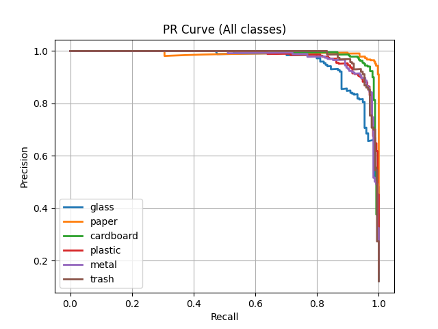 | 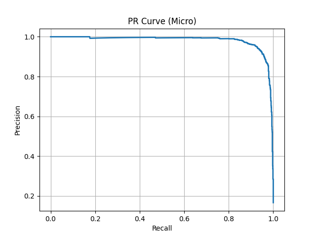

**The overall performance is slightly worse than the previous experiment, but PR curve for class "paper" is better**. Also the PR curve of "**cardboard**" class has been improved. In fact, looking at the confusion matrix, there are minor improvements for class **"cardboard"** and one more correct prediction for class **"paper"**. Only two classes out of six have been improved and the rest, on the contrary, worsened. Thus it is not safe to use vertical flipping as a data augmentation technique for waste classification.

## Experiment 3
Given that vertical flipping, even if slightly, deteriorates performance, let's run an experiment to see if also the **"hue"** parameter, as hyphotetized, deteriorates performance as well and what this means for class paper.
### Configuration
Hue is set to 0.1. The other parameters are the same from Experiment 1.
### Results
Early stopping and checkpointing happened at the same epoch, which is the 18. Thus the "last" and "best" checkpoints are the same one. The following table shows computed metrics.

| Metric | Value |
|:---|:---:|
| Accuracy | 0.9277 | 
| $F_1$ score | 0.9333 | 
| Precision | 0.9340 | 
| Recall | 0.9335 | 

|  | 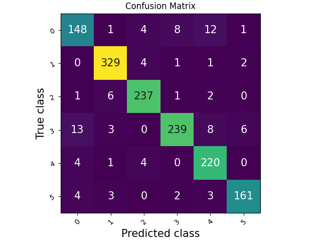 |  
|---------------------------|---------------------------|
|  | 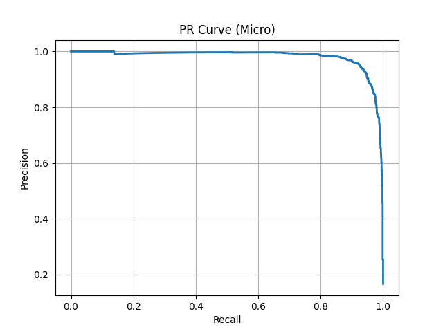

"**Cardboard"** class has a better PR curve than previous experiments. While not disappeared, the PR curve for "**paper**" class has improved. However, looking at the metrics and the confusion matrix, general performance is even worse than using vertical flipping. While helping to solve class "**paper**" issues, the overall performance worsens, thus the configuration used in Experiment 1 is still the best one.

## Experiment 4

### Description
Given that using vertical flipping or tuning the "hue" parameter the performance can't seem to be better, what can the "large" architecture do? Let's find out.

### Configuration
The configuration is the same as Experiment 1, with the only change in the model size which is "large" this time.

### Results
The training took from 2:30 to 2:40 minutes per epoch. Early stopped happened at epoch 11 and checkpointing at epoch 10. The following table shows metrics for both checkpoints.

| Metric | "Last" checkpoint | "Best" checkpoint |
|:---|:---:|:---:|
| Accuracy | 0.9512 | 0.9548 |
| $F_1$ score | 0.9529 | 0.9559 |
| Precision | 0.9536 | 0.9561 |
| Recall | 0.9531 | 0.9559 |

The "best" checkpoint wins.

| 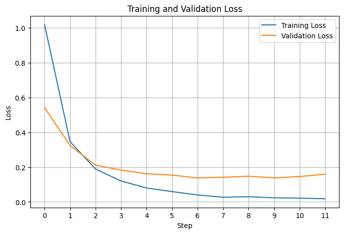 | 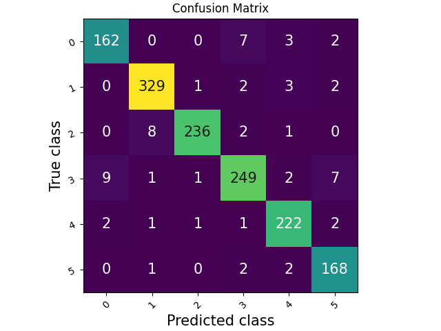 |  
|---------------------------|---------------------------|
| 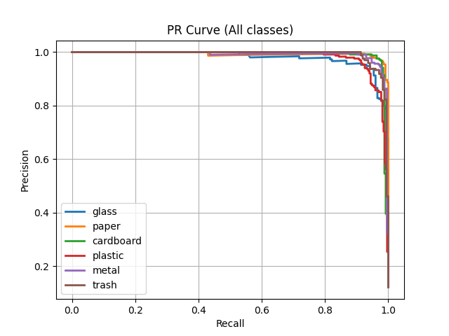 | 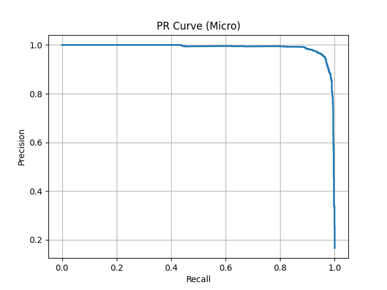

All PR curvers are now similar: **using the large architecture, the model does not struggle to mantain high precision for all classes**. Thus, this is the best trained model so far and is the one ready to be deployed. 

## Conclusions
Experiments have confirmed the hypothesis that certain data augmentation techniques, such as vertical flipping and color jittering, may cause an overall performance worsening. Using the large architecture without those two leads to the best results so far. Future experiments may investigate not only on how to improve performance, but even how to make the model capable of mantaining a high precision for all classes when using the "small" architecture. This could lead to intuitions about new augmentation techniques, such as perspective transforms that could be inputted to the pipeline modifying the WasteClassifierTrainer class.